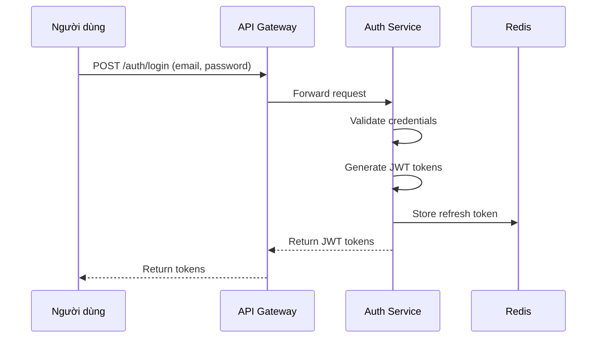
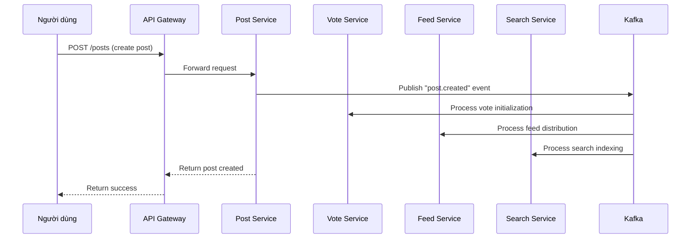

# Software Design Specification - Bear Social Media Platform

## 1. Hệ thống định danh và Bảo mật (Security & Identity)

### 1.1. Authentication Service (Auth Service)

#### Mục tiêu
Thiết kế một dịch vụ xác thực độc lập để quản lý việc đăng ký, đăng nhập, xác thực người dùng và cấp phát token bảo mật.

#### Kiến trúc
- **Tên dịch vụ**: `auth-service`
- **Cổng**: 3005
- **Cơ sở dữ liệu**: PostgreSQL (bear_auth_service)
- **Công nghệ**: Node.js, Fastify, PostgreSQL, Redis, JWT

#### Schema cơ sở dữ liệu
```sql
CREATE TABLE users (
    user_id VARCHAR(50) PRIMARY KEY,
    username VARCHAR(50) UNIQUE NOT NULL,
    email VARCHAR(100) UNIQUE NOT NULL,
    password_hash VARCHAR(255) NOT NULL,
    salt VARCHAR(255) NOT NULL,
    is_active BOOLEAN DEFAULT TRUE,
    is_verified BOOLEAN DEFAULT FALSE,
    created_at TIMESTAMP DEFAULT CURRENT_TIMESTAMP,
    updated_at TIMESTAMP DEFAULT CURRENT_TIMESTAMP,
    last_login_at TIMESTAMP
);

CREATE TABLE refresh_tokens (
    token_id VARCHAR(50) PRIMARY KEY,
    user_id VARCHAR(50) REFERENCES users(user_id),
    token VARCHAR(255) NOT NULL,
    expires_at TIMESTAMP NOT NULL,
    is_revoked BOOLEAN DEFAULT FALSE,
    created_at TIMESTAMP DEFAULT CURRENT_TIMESTAMP
);

CREATE TABLE api_keys (
    api_key_id VARCHAR(50) PRIMARY KEY,
    service_name VARCHAR(100) NOT NULL,
    api_key VARCHAR(255) NOT NULL,
    is_active BOOLEAN DEFAULT TRUE,
    created_at TIMESTAMP DEFAULT CURRENT_TIMESTAMP,
    expires_at TIMESTAMP
);
```

#### API Endpoints
| Method | Endpoint | Description | Authentication |
|--------|----------|-------------|----------------|
| POST | `/auth/register` | Đăng ký người dùng mới | Không yêu cầu |
| POST | `/auth/login` | Đăng nhập người dùng | Không yêu cầu |
| POST | `/auth/logout` | Đăng xuất người dùng | JWT yêu cầu |
| POST | `/auth/refresh` | Làm mới access token | Refresh token yêu cầu |
| POST | `/auth/forgot-password` | Quên mật khẩu | Không yêu cầu |
| POST | `/auth/reset-password` | Đặt lại mật khẩu | Token yêu cầu |

#### Luồng hoạt động đăng nhập


#### Cơ chế quản lý Secret Key và Refresh Token
- **Access Token**: JWT có thời hạn ngắn (15 phút), chứa thông tin người dùng cơ bản
- **Refresh Token**: Token dài hạn (7 ngày), được lưu trữ trong Redis với mã hóa
- **Secret Key**: Được lưu trữ trong hệ thống quản lý bí mật (HashiCorp Vault hoặc AWS Secrets Manager)
- **Token Rotation**: Mỗi lần làm mới token sẽ tạo ra cặp token mới và vô hiệu hóa token cũ

### 1.2. Rate Limiting tại Gateway
- **Công cụ**: Sử dụng `@fastify/rate-limit` plugin
- **Cơ sở dữ liệu lưu trữ**: Redis cluster
- **Cấu hình**:
  - 100 yêu cầu/phút cho người dùng chưa đăng nhập
  - 500 yêu cầu/phút cho người dùng đã đăng nhập
  - 10 yêu cầu/phút cho endpoint đăng nhập (chống brute force)

### 1.3. Service-to-Service Communication
- **Phương thức chính**: Sử dụng API Keys kết hợp với JWT
- **API Keys**: Mỗi dịch vụ có API Key riêng để xác thực với gateway
- **mTLS**: Cho phép tùy chọn trong môi trường production cao cấp

## 2. Đặc tả Dữ liệu và Nhất quán (Data Management)

### 2.1. Schema chi tiết cho từng Service

#### Post Service Schema
```sql
CREATE TABLE posts (
    post_id VARCHAR(50) PRIMARY KEY,
    post_author_id VARCHAR(50) NOT NULL,
    post_content TEXT NOT NULL,
    post_title VARCHAR(255),
    post_tags TEXT[],
    post_status VARCHAR(20) DEFAULT 'published',
    created_at TIMESTAMP DEFAULT CURRENT_TIMESTAMP,
    updated_at TIMESTAMP DEFAULT CURRENT_TIMESTAMP,
    deleted_at TIMESTAMP NULL,
    published_at TIMESTAMP
);

CREATE INDEX idx_posts_author ON posts(post_author_id);
CREATE INDEX idx_posts_created_at ON posts(created_at);
CREATE INDEX idx_posts_status ON posts(post_status);
```

#### User Service Schema
```sql
CREATE TABLE users (
    user_id VARCHAR(50) PRIMARY KEY,
    username VARCHAR(50) UNIQUE NOT NULL,
    email VARCHAR(100) UNIQUE NOT NULL,
    password_hash VARCHAR(255) NOT NULL,
    first_name VARCHAR(50),
    last_name VARCHAR(50),
    bio TEXT,
    avatar_url VARCHAR(255),
    is_active BOOLEAN DEFAULT TRUE,
    is_verified BOOLEAN DEFAULT FALSE,
    created_at TIMESTAMP DEFAULT CURRENT_TIMESTAMP,
    updated_at TIMESTAMP DEFAULT CURRENT_TIMESTAMP,
    deleted_at TIMESTAMP NULL,
    last_login_at TIMESTAMP
);

CREATE INDEX idx_users_email ON users(email);
CREATE INDEX idx_users_username ON users(username);
```

#### Comment Service Schema
```sql
CREATE TABLE comments (
    comment_id VARCHAR(50) PRIMARY KEY,
    post_id VARCHAR(50) NOT NULL,
    user_id VARCHAR(50) NOT NULL,
    parent_comment_id VARCHAR(50) NULL, -- For nested comments
    content TEXT NOT NULL,
    is_edited BOOLEAN DEFAULT FALSE,
    created_at TIMESTAMP DEFAULT CURRENT_TIMESTAMP,
    updated_at TIMESTAMP DEFAULT CURRENT_TIMESTAMP,
    deleted_at TIMESTAMP NULL
);

CREATE INDEX idx_comments_post ON comments(post_id);
CREATE INDEX idx_comments_user ON comments(user_id);
CREATE INDEX idx_comments_parent ON comments(parent_comment_id);
```

### 2.2. Saga Pattern cho luồng phức tạp

#### Ví dụ: Tạo bài viết mới (Create Post Saga)


#### Các bước trong Saga:
1. **Step 1**: Tạo bài viết trong Post Service
2. **Step 2**: Khởi tạo điểm vote (0 upvote, 0 downvote) trong Vote Service
3. **Step 3**: Thêm bài viết vào feed của người theo dõi trong Feed Service
4. **Step 4**: Thêm bài viết vào chỉ mục tìm kiếm trong Search Service
5. **Compensation**: Nếu bất kỳ bước nào thất bại, thực hiện hành động bù trừ

### 2.3. Database Migration Strategy
- **Công cụ**: Sử dụng Flyway cho quản lý migration
- **Ngôn ngữ**: Postgres SQL (ưu tiên)
- **Chiến lược**:
  - Versioned migrations cho thay đổi cấu trúc
  - Repeatable migrations cho dữ liệu tĩnh
  - Baseline cho cơ sở dữ liệu đã tồn tại
- **Quy trình CI/CD**: Tự động chạy migration trước khi deploy

## 3. Giao tiếp và Hiệu năng (Communication & Performance)

### 3.1. API Specification theo chuẩn OpenAPI

#### Ví dụ: Post Service API
```yaml
openapi: 3.0.0
info:
  title: Post Service API
  version: 1.0.0
paths:
  /posts:
    get:
      summary: Lấy danh sách bài viết
      parameters:
        - name: limit
          in: query
          schema:
            type: integer
            default: 20
        - name: offset
          in: query
          schema:
            type: integer
            default: 0
      responses:
        '200':
          description: Danh sách bài viết
          content:
            application/json:
              schema:
                type: object
                properties:
                  posts:
                    type: array
                    items:
                      $ref: '#/components/schemas/Post'
                  total:
                    type: integer
```

### 3.2. Event Schema cho Kafka

#### Các loại sự kiện chính:
- `user.created`: Khi người dùng mới được tạo
- `user.updated`: Khi thông tin người dùng được cập nhật
- `post.created`: Khi bài viết mới được tạo
- `post.updated`: Khi bài viết được cập nhật
- `post.deleted`: Khi bài viết bị xóa
- `comment.created`: Khi bình luận mới được tạo
- `vote.changed`: Khi có thay đổi về vote

#### Ví dụ: post.created event
```json
{
  "eventId": "uuid",
  "eventType": "post.created",
  "timestamp": "2023-10-01T10:00:00Z",
  "source": "post-service",
  "payload": {
    "postId": "post-123",
    "authorId": "user-456",
    "title": "Tiêu đề bài viết",
    "content": "Nội dung bài viết",
    "createdAt": "2023-10-01T10:00:00Z"
  }
}
```

### 3.3. Caching Strategy

#### Dữ liệu nên cache trong Redis:
- **User Profile**: Cache 30 phút, invalid khi user.update
- **Top Feed Items**: Cache 10 phút, refresh định kỳ
- **Popular Posts**: Cache 15 phút, dựa trên số lượng view/vote
- **Session Data**: Cache theo thời hạn session

#### Chiến lược Cache Invalidation:
- **Write-through**: Cập nhật cache ngay khi ghi vào DB
- **Cache-aside**: Tải dữ liệu vào cache khi đọc nếu chưa có
- **Time-based expiration**: Tự động hết hạn sau thời gian xác định

## 4. Khả năng chịu tải và Giám sát (Resilience & Observability)

### 4.1. Circuit Breaker Implementation
- **Công cụ**: Sử dụng `@bull-queue/circuit-breaker` hoặc tích hợp custom
- **Cấu hình**:
  - Threshold: 5 lỗi liên tiếp
  - Timeout: 30 giây
  - Half-open thử lại: 1 request sau timeout
- **Áp dụng**: Cho các service gọi đến nhau (Post -> Vote, User -> Auth)

### 4.2. Centralized Logging
- **Công cụ**: ELK Stack (Elasticsearch, Logstash, Kibana) hoặc Grafana Loki
- **Định dạng log**: JSON với các trường chuẩn:
  ```json
  {
    "timestamp": "2023-10-01T10:00:00Z",
    "level": "INFO",
    "service": "post-service",
    "correlationId": "abc-123-def",
    "userId": "user-456",
    "operation": "createPost",
    "message": "Post created successfully",
    "duration": 150
  }
  ```
- **Correlation ID**: Được truyền qua các service để truy vết request

### 4.3. Monitoring Metrics
- **Công cụ**: Prometheus + Grafana
- **Chỉ số cần theo dõi**:

| Metric | Mô tả | Labels |
|--------|-------|---------|
| `http_requests_total` | Tổng số request HTTP | method, path, status_code |
| `http_request_duration_seconds` | Thời gian xử lý request | method, path |
| `database_connections` | Số lượng kết nối DB | service, pool |
| `cache_hits_total` | Số lần cache hit | service, cache_type |
| `kafka_consumer_lag` | Độ trễ consumer Kafka | topic, partition |

## 5. Deployment & CI/CD

### 5.1. Docker Multi-stage Build
```dockerfile
# Stage 1: Build
FROM node:18-alpine AS builder
WORKDIR /app
COPY package*.json ./
RUN npm ci --only=production
COPY . .
RUN npm run build

# Stage 2: Production
FROM node:18-alpine AS production
WORKDIR /app
COPY --from=builder /app/dist ./dist
COPY --from=builder /app/node_modules ./node_modules
COPY package*.json ./
EXPOSE 3000
USER node
CMD ["node", "dist/server.js"]
```

### 5.2. Kubernetes Deployment Configuration

#### Resource Limits
```yaml
apiVersion: apps/v1
kind: Deployment
metadata:
  name: post-service
spec:
  replicas: 3
  template:
    spec:
      containers:
      - name: post-service
        resources:
          requests:
            memory: "256Mi"
            cpu: "250m"
          limits:
            memory: "512Mi"
            cpu: "500m"
```

#### Horizontal Pod Autoscaler (HPA)
```yaml
apiVersion: autoscaling/v2
kind: HorizontalPodAutoscaler
metadata:
  name: post-service-hpa
spec:
  scaleTargetRef:
    apiVersion: apps/v1
    kind: Deployment
    name: post-service
  minReplicas: 3
  maxReplicas: 10
  metrics:
  - type: Resource
    resource:
      name: cpu
      target:
        type: Utilization
        averageUtilization: 70
```

### 5.3. CI/CD Pipeline
- **Công cụ**: GitHub Actions hoặc GitLab CI
- **Các giai đoạn**:
  1. Unit Testing
  2. Integration Testing
  3. Security Scanning
  4. Build Docker Image
  5. Push to Registry
  6. Deploy to Staging
  7. E2E Testing
  8. Deploy to Production

---

Tài liệu này cung cấp đặc tả kỹ thuật chi tiết cho việc nâng cấp hệ thống Bear Social Media Platform lên mức "Production-Ready", giải quyết các vấn đề hiện tại và thiết lập nền tảng vững chắc cho tương lai.
